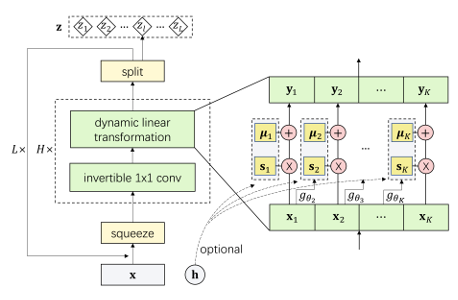

# Dynamic Linear Flow (DLF)
Code for reproducing results in ["Generative Model with Dynamic Linear Flow"](https://arxiv.org/pdf/1905.03239)

In our paper, we proposed Dynamic Linear Flow, a new family of exact likelihood-based methods. Our method benefits from the efficient
computation of flow-based methods (RealNVP, Glow, etc.) and high density estimation performance of autoregressive methods (PixelCNN, PixelSNAIL etc.). DLF yields state-of-the-art performance in density estimation benchmarks and efficiently synthesizes high-resolution images. Additionally, DLF converges 10x faster than other flow-based models such as Glow.
Read our [paper](https://arxiv.org/pdf/1905.03239) for more details.

<p align="center">

</p>

## Requirements

 - TensorFlow (tested with v1.12)


## Setup

1. Install requirements

2. Clone this repo or click the [Download ZIP](https://github.com/naturomics/DLF/archive/master.zip) button on upper right corner
```
git clone https://github.com/naturomics/DLF
cd DLF
```

3. Download Datasets

All datasets are saved to folder `data/{dataset_name}` as default. If your datasets are saved at a different folder,
please specify it via `--data_dir` command line or change the default value in `main.py` file to point to the right folder.

- MNIST and CIFAR10 will be directly downloaded by the code.
- The preprocessed and downsampled `ImageNet` dataset can be downloaded from `https://storage.googleapis.com/glow-demo/data/imagenet-oord-tfr.tar`, 32x32 and 64x64 version included. Extract and move files to the corresponding folder (`r05` in the filename refers to resolution 2**5=32): 
```
mkdir -p data/imagenet{32x32,64x64}/{train,validation}
tar -xf imagenet-oord-tfr.tar

mv mnt/host/imgenet-oord-tfr/train/*r05*.tfrecords data/imagenet32x32/train
mv mnt/host/imgenet-oord-tfr/validation/*r05*.tfrecords data/imagenet32x32/validation

mv mnt/host/imgenet-oord-tfr/train/*r06*.tfrecords data/imagenet64x64/train
mv mnt/host/imgenet-oord-tfr/validation/*r06*.tfrecords data/imagenet64x64/validation
```

- The preprocessed `CelebA 256x256` is from `https://storage.googleapis.com/glow-demo/data/celeba-tfr.tar`. Extract it to folder `data/celeba`, for example:
```
wget https://storage.googleapis.com/glow-demo/data/celeba-tfr.tar
tar -xf celeba-tfr.tar
mv celeba-tfr data/celeba
```

If you are interested, see the scripts [here](https://github.com/openai/glow/tree/master/data_loaders/generate_tfr) to learn how these tfrecord files were generated.


## Train the model
Outputs during training (train loss, validation loss, samples and model checkpoints) are saved to folder specified by `--results_dir`.
Using `--num_gpus` for multiple GPUs training. Run `python main.py -h` for more helps.


#### CIFAR 10 with K=2, non-inverse dynamic linear transformation
```
# unconditional
python main.py --results_dir results/cifar10_noCond --seed [0/1/2]
# class label conditional
python main.py --results_dir results/cifar10_addCond --conditioning --seed [0/1/2]
```

#### CIFAR 10 with K=2, inverse dynamic linear transformation
```
python main.py --results_dir results/cifar10_noCond_extraDep --decomposition 1 --seed [0/1/2]
```

#### CIFAR 10 with K=4 and 6, non-inverse dynamic linear transformation
```
python main.py --results_dir results/cifar10_noCond_4parts --num_parts 4 --width 308 --seed [0/1/2]
python main.py --results_dir results/cifar10_noCond_6parts --num_parts 6 --width 256 --seed [0/1/2]
```

#### ImageNet 32x32
```
python main.py --problem imagenet32x32 --results_dir results/imgnet32_noCond
```

#### ImageNet 64x64
```
python main.py --problem imagenet64x64 --results_dir results/imgnet64_noCond --num_levels 4 --width 384 --invconv_bias --batch_size 24
```

#### MNIST
```
# unconditional
python main.py --problem mnist --results_dir results/mnist_noCond --num_levels 2 --width 128 --batch_size 256
# class label conditional
python main.py --problem mnist --results_dir results/mnist_addCond --num_levels 2 --width 128 --conditioning --batch_size 256
```

#### CekebA-HQ 256x256
```
python main.py --problem celeba --results_dir results/celeba_noCond --num_levels 6 --width 128 --batch_size 4 --num_gpus 2 --l2_factor 0.1
```

## Interpolation between images

Run the script `demo.py` to generate linearly interpolated samples between two real images:
```
# Specify --results_dir with results path of CelebA, e.g.
python demo.py --results_dir results/celeba_noCond
```
The outputs are saved to `demo` directory as default.

## Pre-trained models
We will soon upload our trained models.

## Train with your own dataset 
We use tf.data API for data reading pipeline and we have written a script to standardize the code. To train with your own dataset,
all you need to do is writing the tfrecords maker and the corresponding parse function, and import it in file `datasets/__init__.py`.
See `datasets/cifar10.py`, `datasets/mnist.py` etc. for examples. When training, specify your dataset by `--problem {dataset_name}`
 command line, where `dataset_name` is your script name. We will write a more detailed tutorial if needed.
